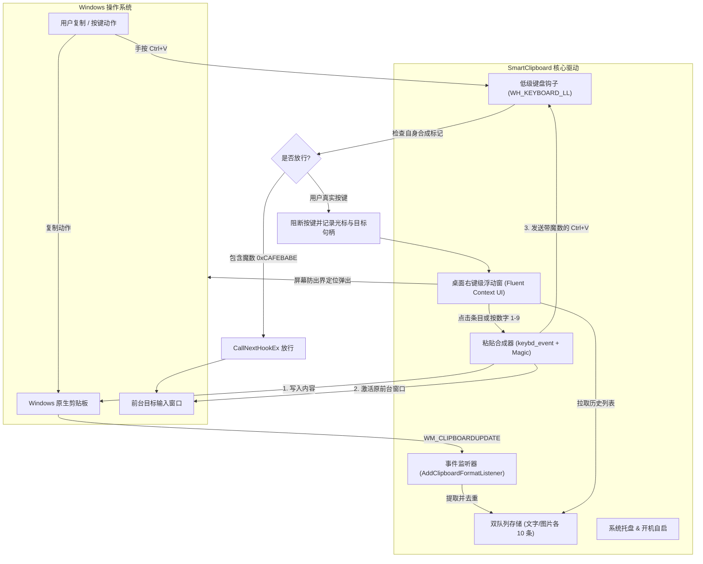

# Smart Clipboard Manager (智能桌面剪贴板)

<p align="center">
  
</p>

<p align="center">
  <b>极简 · 零轮询 · 毫秒级弹出 · 专为 Windows 定制的现代智能剪贴板管理工具</b>
</p>

<p align="center">
  <a href="LICENSE"></a>
  
  
  
</p>

---

## 🌟 核心特性 (Key Features)

- ⚡ **全局按键拦截**：按下常规的 `Ctrl + V` 组合键时，瞬间拦截原始粘贴动作，并在鼠标光标位置就近弹出桌面右键菜单质感的浮动选择框。
- 🎯 **双分类独立历史**：顶部提供「📝 文字」与「🖼️ 图片」两个分类标签页，各自独立维护最近 **10 条** 历史记录，先进先出（FIFO）。
- 🚀 **智能防重复提升 (MRU)**：若重新复制已存在的历史内容，自动刷新时间戳并提升至队首，不浪费历史名额。
- 💨 **极速粘贴体验**：
  - **鼠标操作**：直接点击条目卡片即可立即自动粘贴到目标输入框；
  - **键盘操作**：直接按下数字键 `1 ~ 9` 或 `0` 即可快速粘贴对应序号的条目；
  - **快速关闭**：按下 `ESC` 或直接点击窗口外部任意区域（失焦），弹窗秒关。
- 🔄 **防死循环按键签名协议**：利用 Windows 底层钩子携带的 `0xCAFEBABE` 签名标记，程序内部合成按键直接放行，彻底消除递归拦截与死锁。
- 💻 **全终端深度适配 (Terminal Support)**：原生兼容 Windows Terminal、Git Bash (mintty)、PowerShell、CMD、WSL、PuTTY 等。终端环境下不仅支持 `Ctrl + V`，亦支持终端惯用 `Ctrl + Shift + V` 快速唤起；粘贴时自动路由至终端通用协议 `Shift + Insert`，彻底解决传统工具输出 `^V` 乱码与无法粘贴的顽疾。
- 🛡️ **管理员终端与前台穿透**：采用模拟 Alt 键与前台线程关联技术穿透 Windows 前台焦点锁，托盘支持一键「以管理员身份重启」，轻松控制管理员权限终端（完美解决 UIPI 限制）。
- 🛠️ **系统托盘与开机自启**：Windows 任务栏右下角常驻托盘图标，支持随时一键暂停/恢复拦截、清空历史、开机自启动开关、管理员提权以及安全退出。


---

## 📐 系统架构与工作流 (Architecture)



---

## ⌨️ 快捷键指南 (Shortcuts)

| 按键 | 功能描述 |
| :--- | :--- |
| `Ctrl + V` | 全局唤起智能剪贴板菜单（若暂停拦截则恢复系统默认粘贴） |
| `Ctrl + Shift + V` | 在终端环境下亦可直接唤起智能剪贴板菜单（符合终端常用快捷键习惯） |
| `Tab` | 快速在「📝 文字」与「🖼️ 图片」选项卡之间切换 |
| `1` ~ `9`, `0` | 极速粘贴第 1 ~ 10 条对应历史记录 |
| `ESC` / `鼠标点击外部` | 瞬间关闭浮动菜单 |


---

## 📦 安装与使用 (Quick Start)

### 方式一：直接运行预编译的独立 EXE (推荐)
无需安装 Python 环境，开箱即用：
1. 从 [Releases](../../releases) 页面下载 `SmartClipboard.exe`；
2. 双击直接启动运行，右下角将出现剪贴板托盘图标；
3. 右键托盘图标可勾选「开机自启动」，之后开机将自动静默常驻。

### 方式二：从源码运行

```powershell
# 1. 克隆代码仓库
git clone https://github.com/YOUR_USERNAME/smart-clipboard.git
cd smart-clipboard

# 2. 安装依赖
pip install -r requirements.txt

# 3. 运行应用程序
python main.py
```

### 方式三：自行编译打包单文件 EXE

项目中已配备完整的自动化编译脚本：

```powershell
# 运行自动化测试并编译为独立 EXE
powershell -ExecutionPolicy Bypass -File .\build.ps1
```
编译产物将自动生成于 `dist/SmartClipboard.exe`。

---

## 🧪 单元测试 (Testing)

项目遵守严格的工业级单元测试标准，覆盖存储容量上限限制、去重提升机制、图像微缩图生成、注册表开机启动读写以及多线程高频并发安全：

```powershell
python -m unittest discover -s tests -p "test_*.py" -v
```

---

## 🤝 参与贡献 (Contributing)

欢迎提交 Issue 和 Pull Request！请参阅 [CONTRIBUTING.md](CONTRIBUTING.md) 了解详细的开发与代码提交规范。

---

## 📄 开源许可证 (License)

本项目采用 [MIT License](LICENSE) 开源许可证。
